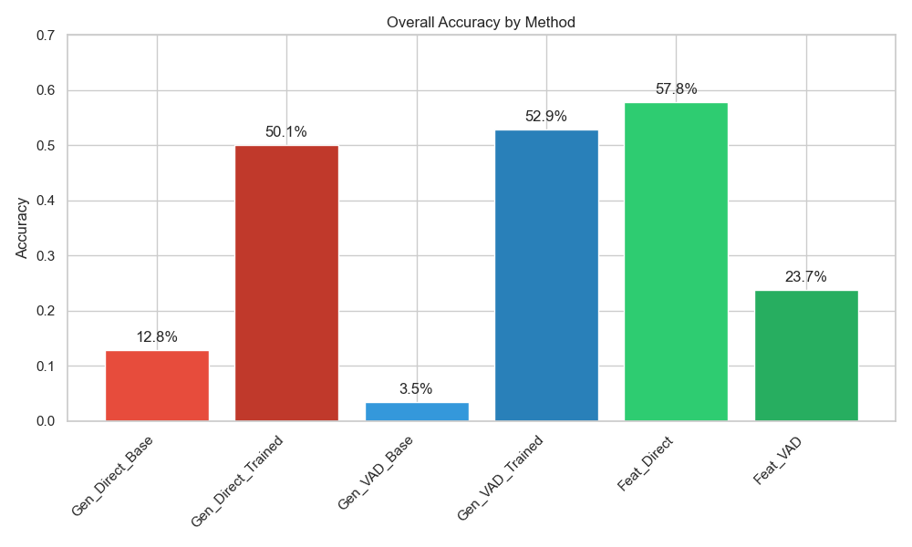
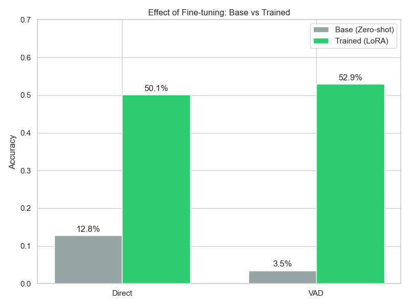
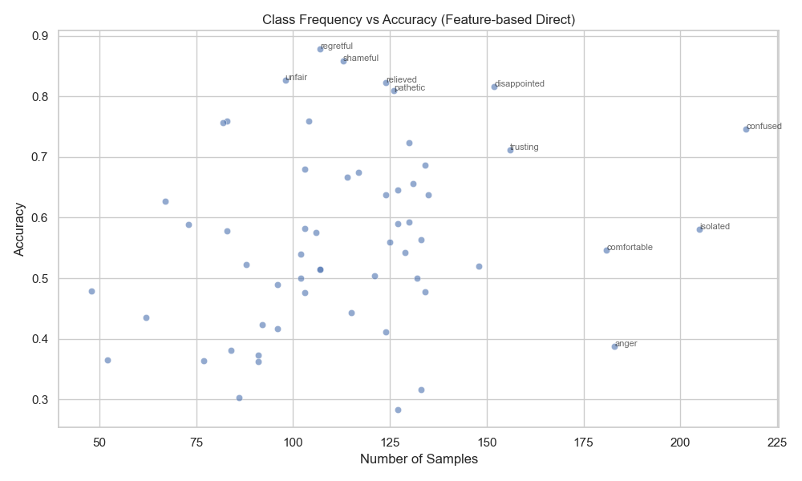
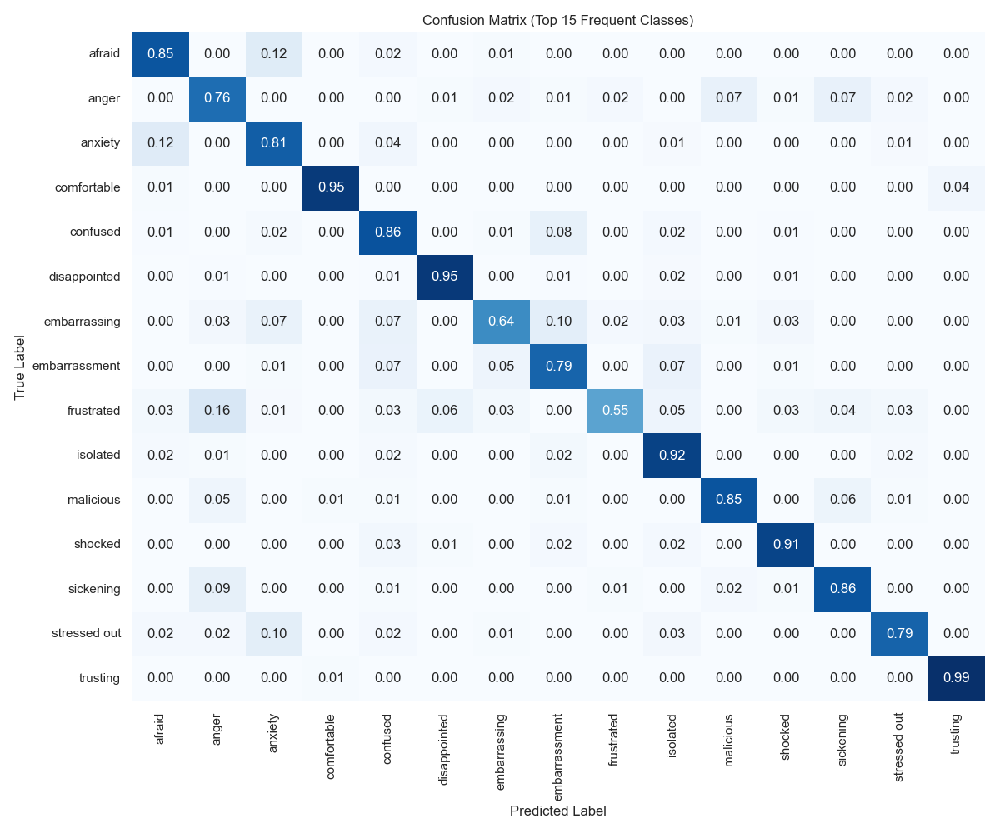

# snu-nlp-2025f-project

LoRA fine-tuning experiments for counselling-dialog emotion understanding.  
Four modelling strategies are implemented on multi-turn counsellor–client conversations:

1. **Generative Emotion Classification** – prompt the model to output a single label directly.  
2. **Generative VAD Estimation** – predict Valence/Arousal/Dominance scores and map them onto labels.  
3. **Feature-Based Classification** – encode the dialogue with a feature prompt and classify via a sequence-classification head.  
4. **Feature-Based VAD Regression** – regress VAD scores from the feature prompt, then map to labels.

Meta-Llama-3.1-8B-Instruct is used as the base model for every configuration, and all adapters are trained with LoRA.

---

## Environment

- **Python**: 3.10 (recommended)  
- **Dependencies**: install via `pip install -r requirements.txt`

Main libraries: `transformers`, `accelerate`, `trl`, `peft`, `datasets`, `evaluate`, `scikit-learn`, `numpy`, `pyyaml`.

---

## Dataset Expectations

All scripts assume a Hugging Face datasets-compatible structure (JSON/Parquet/etc.) with fields:

```jsonc
{
  "turns": [
    {"speaker": "client", "text": "..."},
    {"speaker": "therapist", "text": "..."}
  ],
  "emotion": "Gratitude",             // String label
  "vad": {                            // Optional for label-only runs, required for VAD tasks
    "valence": 0.74,
    "arousal": 0.53,
    "dominance": 0.61
  }
}
```

Create `train`, `validation`, and (optionally) `test` splits or update the script arguments to match your custom split names.
For emotion/VAD supervision, the target label must correspond to the final occurrence of the chosen speaker (default: the `client`). Only the turns *before* that utterance appear in `{context}`; later turns are ignored.

---

## Prompt Configuration

Prompts are centralised in `config/prompts.yaml`. Each entry has `system`/`user` sections written in Korean, rendered with the official Llama chat template. The user message separates the **dialogue context** (`{context}`) and the **target utterance** (`{target_utterance}`) so the model focuses on the final speaker turn while still seeing the preceding conversation.

---

## Training

All training scripts live in `train/` and accept Hugging Face dataset identifiers or local dataset paths.

### 1. Direct Emotion Classification (Generative)
```bash
python train/train_lora_direct_classification.py \
  --dataset_name path/to/dataset \
  --train_split train \
  --eval_split validation \
  --label_key emotion \
  --target_speaker client \
  --prompt_config config/prompts.yaml \
  --output_dir outputs/direct-class
```

### 2. VAD Generation (Generative)
```bash
python train/train_lora_vad_generation.py \
  --dataset_name path/to/dataset \
  --vad_key vad \
  --target_speaker client \
  --prompt_config config/prompts.yaml \
  --output_dir outputs/vad-gen
```

### 3. Feature-Based Classification (Sequence Classification Head)
```bash
python train/train_feature_classifier.py \
  --dataset_name path/to/dataset \
  --label_key emotion \
  --target_speaker client \
  --prompt_config config/prompts.yaml \
  --output_dir outputs/feature-class
```

### 4. Feature-Based VAD Regression
```bash
python train/train_feature_vad.py \
  --dataset_name path/to/dataset \
  --vad_key vad \
  --target_speaker client \
  --prompt_config config/prompts.yaml \
  --output_dir outputs/feature-vad
```

---

## Inference

Inference scripts reside in `inference/`. Supply the path to the trained adapter, base model name, prompt configuration, and a JSON conversation file matching the dataset schema.

### Direct Emotion Prediction
```bash
python inference/infer_lora_direct_classification.py \
  --adapter_dir outputs/direct-class \
  --model_name meta-llama/Meta-Llama-3.1-8B-Instruct \
  --target_speaker client \
  --prompt_config config/prompts.yaml \
  --conversation_path sample_dialogue.json
```

### VAD Generation → Label Mapping
```bash
python inference/infer_lora_vad_generation.py \
  --adapter_dir outputs/vad-gen \
  --target_speaker client \
  --prompt_config config/prompts.yaml \
  --conversation_path sample_dialogue.json
```

### Feature-Based Classification
```bash
python inference/infer_feature_classifier.py \
  --adapter_dir outputs/feature-class \
  --target_speaker client \
  --prompt_config config/prompts.yaml \
  --conversation_path sample_dialogue.json
```

### Feature-Based VAD Regression
```bash
python inference/infer_feature_vad.py \
  --adapter_dir outputs/feature-vad \
  --target_speaker client \
  --prompt_config config/prompts.yaml \
  --conversation_path sample_dialogue.json
```

- All evaluations focus on classification metrics; compute macro/micro F1 and ROC-AUC for the target emotion labels.

---

## Repository Layout

```
config/            # Prompt configuration (YAML)
train/             # Training scripts for the four modes
inference/         # Matching inference scripts
requirements.txt   # Python dependencies
utils.py           # Shared utilities: prompt rendering, dialogue formatting, catalog helpers
```

---

## Results & Analysis

### 🎯 Research Goal
Our primary goal was to investigate **how to best leverage LLMs for fine-grained emotion recognition** (60 classes). Specifically, we wanted to answer two key questions:
1.  **Direct vs. VAD**: Does incorporating domain knowledge (Valence-Arousal-Dominance) help the LLM understand complex emotions better than simply asking for the label?
2.  **Generation vs. Features**: Is it better to let the LLM **directly generate** the answer (text/numbers) or use its internal representations (**features**) with a classifier?

---

### 1. Key Findings: Does VAD Help?

**Yes, especially for Generative Models.**

While the Feature-Based Direct model achieved the highest raw accuracy, the **Generative VAD** approach significantly outperformed the Generative Direct approach.



| Method | Type | Accuracy | **Macro-F1** | Interpretation |
| :--- | :--- | :--- | :--- | :--- |
| **Feature-Based Direct** | Discriminative | **58.49%** | **56.59%** | Best overall. LLM features are highly robust. |
| **Generative VAD** | Generative | **52.91%** | **51.35%** | **Maps to easier continuous space.** |
| **Generative Direct** | Generative | 50.06% | 48.66% | Struggles to pinpoint exact complex labels. |
| **Feature-Based VAD** | Discriminative | 25.47% | 24.26% | Regression loss is too high for features. |

> **Insight**: Predicting **abstract coordinates (VAD)** is an easier task for the LLM than retrieving the exact class name from 60 options. The VAD step simplifies the problem by converting a 60-way classification into a 3-dimensional regression.

---

### 2. Effect of Fine-tuning (Base vs. Trained)

Does the LLM already know these emotions, or does it need to learn them?
Our results show that **Fine-tuning is mandatory** for this task. The Base model (Llama-3.1-8B-Instruct) completely fails to understand the specific 60-class ontology in a Zero-shot setting.



- **Direct Classification**: `12.8%` (Base) → `50.1%` (Trained)
    - The Base model only predicts common words like `sorrow` or `worried` but fails on domain-specific terms like `guilty conscience` or `underprivileged`.
- **VAD Generation**: `3.5%` (Base) → `52.9%` (Trained)
    - **Critical Insight**: The Base model has **no internal alignment** between the VAD numerical scale and the specific emotion labels. Fine-tuning aligns the model's abstract understanding of "valence/arousal" with the target label space.

---

### 3. Can LLMs Predict Emotional Values? (VAD Precision)

We tested if LLMs can directly generate accurate numerical values for emotion.
**Result**: They are excellent at **Valence (Good/Bad)** but struggle with **Arousal (Calm/Excited)**.


- **Valence (MSE 0.050)**: The model perfectly understands the positivity/negativity of the dialogue.
- **Arousal (MSE 0.120)**: Inferring emotional intensity from text alone is challenging for the LLM without audio/visual cues.

---

### 4. Detailed Analysis

#### A. Robustness (Frequency vs. Accuracy)
Does the model just memorize frequent classes? **No.**
We found a weak correlation between data size and accuracy. The model successfully learns the **semantics** of low-resource emotions.


*Example: `underprivileged` (n=67) has 63% accuracy, comparable to high-resource classes.*

#### B. Error Analysis
Even when the model fails, it fails **intelligently**. Most errors stem from semantic overlaps rather than hallucinations.


*   **Synonyms**: `anger` vs. `angry` (Model sees them as identical).
*   **Hierarchy**: `solitary` vs. `isolated` (Specific vs. General).

---

### 5. Conclusion & Implications

1.  **Continuous Space vs. Discrete Labels**:
    Directly classifying text into 60 discrete classes is a "hard" task due to high dimensionality and semantic overlap.
    Predicting **VAD coordinates (Continuous Space)** is an "easier" regression task for the LLM. By converting the problem into a coordinate prediction task, we bypass the difficulty of distinguishing between subtle linguistic labels.

2.  **Feature-based is still King for Accuracy**:
    For pure classification performance, using the LLM as a feature extractor (Discriminative approach) remains the most robust method, outperforming generative approaches.

3.  **Hybrid Potential**:
    The Generative VAD model correctly solves **~5% of cases** that the Feature-based model misses. This suggests that the two models capture different aspects of emotion: one captures semantic features, while the other captures affective intensity.

