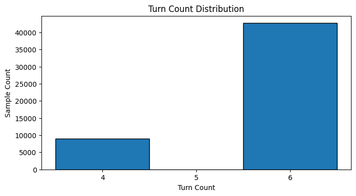
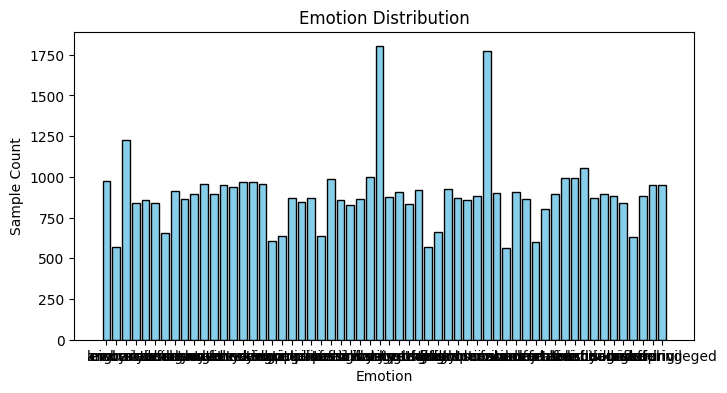
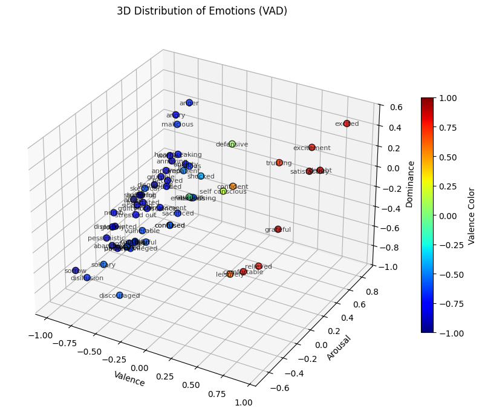

# 데이터 디렉토리

이 디렉토리는 프로젝트에서 사용하는 모든 데이터와 데이터 처리 스크립트를 포함합니다.

## 디렉토리 구조

```text
data/
├── README.md                           
├── training_turn_distribution.png      
├── training_emotion_distribution.png   
├── vad_distribution.png                
├── raw/                                # 원본 데이터
│   ├── metadata/                       # 메타데이터 및 매핑 파일
│   │   ├── emotions.tsv                # 감정 키-영어명-VAD 값 매핑
│   │   ├── emotion_key_mapping.tsv
│   │   ├── emotions_with_translation.tsv
│   │   ├── NRC-VAD-Lexicon-v2.1.txt
│   │   ├── match_vad.py                # VAD 매칭 스크립트
│   │   └── translate_emotions.py
│   ├── training/                       # 학습 데이터
│   │   ├── training.json               # 원본 JSON 형식
│   │   └── training.xlsx
│   └── validation/                     # 검증 데이터
│       ├── validation.json
│       └── validation.xlsx
└── formatted/                          # 포맷팅된 데이터 및 스크립트
    ├── format_data.py                  # 데이터 변환 스크립트
    ├── data_analysis.ipynb             # 데이터 분석 노트북
    ├── training.jsonl                  # 포맷팅된 학습 데이터
    └── validation.jsonl                # 포맷팅된 검증 데이터
```

## 데이터 형식

### 원본 데이터 형식 (raw/)

원본 데이터는 다음과 같은 JSON 구조를 가집니다:

```json
{
  "profile": {
    "persona-id": "Pro_05349",
    "persona": {
      "persona-id": "A02_G02_C01",
      "human": ["A02", "G02"],
      "computer": ["C01"]
    },
    "emotion": {
      "emotion-id": "S06_D02_E18",
      "type": "E18",
      "situation": ["S06", "D02"]
    }
  },
  "talk": {
    "id": {
      "profile-id": "Pro_05349",
      "talk-id": "Pro_05349_00053"
    },
    "content": {
      "HS01": "일은 왜 해도 해도 끝이 없을까? 화가 난다.",
      "SS01": "많이 힘드시겠어요. 주위에 의논할 상대가 있나요?",
      "HS02": "그냥 내가 해결하는 게 나아. 남들한테 부담 주고 싶지도 않고.",
      "SS02": "혼자 해결하기로 했군요. 혼자서 해결하기 힘들면 주위에 의논할 사람을 찾아보세요.",
      "HS03": "",
      "SS03": ""
    }
  }
}
```

### 포맷팅된 데이터 형식 (formatted/)

포맷팅된 데이터는 JSONL 형식(한 줄에 하나의 JSON 객체)으로 저장되며, 다음과 같은 구조를 가집니다:

```json
{
  "turns": [
    {"speaker": "client", "text": "일은 왜 해도 해도 끝이 없을까? 화가 난다."},
    {"speaker": "therapist", "text": "많이 힘드시겠어요. 주위에 의논할 상대가 있나요?"},
    {"speaker": "client", "text": "그냥 내가 해결하는 게 나아. 남들한테 부담 주고 싶지도 않고."},
    {"speaker": "therapist", "text": "혼자 해결하기로 했군요. 혼자서 해결하기 힘들면 주위에 의논할 사람을 찾아보세요."}
  ],
  "emotion": "angry",
  "vad": {
    "valence": -0.756,
    "arousal": 0.66,
    "dominance": 0.208
  }
}
```

## 스크립트 설명

### `formatted/format_data.py`

원본 데이터를 모델 학습에 적합한 형식으로 변환하는 스크립트입니다.

#### 주요 기능

- **스피커 매핑**:
  - `HS**` (Human Speaker) → `speaker: "client"`
  - `SS**` (System Speaker) → `speaker: "therapist"`
- **감정 매핑**: `profile.emotion.type` (예: "E18")을 `emotions.tsv`에서 조회하여 영어 감정명으로 변환
- **VAD 값 매핑**: `emotions.tsv`에서 `valence`, `arousal`, `dominance` 값을 추출
- **빈 텍스트 제거**: `trim()` 후 빈 텍스트인 턴은 자동으로 제거
- **순서 보장**: 대화 턴을 숫자 순서(HS01, SS01, HS02, SS02...)로 정렬

#### 사용법

##### 기본 사용 (전체 데이터 변환)

```bash
python3 data/formatted/format_data.py \
  --input data/raw/training/training.json \
  --output data/formatted/training.jsonl
```

##### 샘플 모드 (첫 번째 데이터만 변환, 테스트용)

```bash
python3 data/formatted/format_data.py \
  --input data/raw/training/training.json \
  --output data/formatted/training_sample.jsonl \
  --isSample
```

##### 커스텀 emotions.tsv 경로 지정

```bash
python3 data/formatted/format_data.py \
  --input data/raw/training/training.json \
  --output data/formatted/training.jsonl \
  --emotions-tsv data/raw/metadata/emotions.tsv
```

#### 인자 설명

- `--input` (필수): 입력 JSON 파일 경로
- `--output` (필수): 출력 JSONL 파일 경로
- `--emotions-tsv` (선택): emotions.tsv 파일 경로 (기본값: `data/raw/metadata/emotions.tsv`)
- `--isSample` (선택): 첫 번째 레코드만 변환하는 플래그 (테스트용)

#### 출력 예시

```text
Loading emotions mapping from data/raw/metadata/emotions.tsv...
Loaded 60 emotion mappings
Reading input file: data/raw/training/training.json...
Found 51628 records
Converting and writing to data/formatted/training.jsonl...
Processed 1000/51628 records...
Processed 2000/51628 records...
...

Conversion complete!
  Converted: 51628
  Skipped: 0
  Output file: data/formatted/training.jsonl
```

## 메타데이터 파일

### `raw/metadata/emotions.tsv`

감정 키, 영어명, VAD 값을 매핑하는 TSV 파일입니다.

컬럼 구조:

- `ko`: 한국어 감정명
- `key`: 감정 키 (예: "E18")
- `en`: 영어 감정명 (예: "angry")
- `valence`: Valence 값 (-1.0 ~ 1.0)
- `arousal`: Arousal 값 (-1.0 ~ 1.0)
- `dominance`: Dominance 값 (-1.0 ~ 1.0)

## 데이터 통계

### 턴 수 분포

학습 데이터의 대화 턴 수 분포입니다. 대부분의 샘플이 6턴을 가지며, 4턴을 가지는 샘플은 상대적으로 적고, 5턴을 가지는 샘플은 거의 없습니다.



### 감정 분포

학습 데이터에 포함된 감정의 분포입니다.



### VAD 공간에서의 감정 분포

감정들이 Valence-Arousal-Dominance (VAD) 공간에서 어떻게 분포하는지를 보여주는 3D 산점도입니다. 음의 Valence를 가진 감정들은 왼쪽(파란색)에, 양의 Valence를 가진 감정들은 오른쪽(빨간색)에 클러스터를 형성합니다.



## 데이터 처리 워크플로우

1. **원본 데이터 준비**: `raw/training/` 또는 `raw/validation/`에 원본 JSON 파일 배치
2. **데이터 변환**: `format_data.py` 스크립트를 사용하여 포맷팅된 JSONL 파일 생성
3. **모델 학습**: 포맷팅된 데이터를 사용하여 모델 학습 진행

## 주의사항

- 원본 데이터 파일은 절대 수정하지 마세요. 필요시 백업을 먼저 생성하세요.
- 포맷팅된 데이터는 JSONL 형식으로 저장되며, 각 줄이 독립적인 JSON 객체입니다.
- 빈 텍스트를 가진 턴은 자동으로 제거됩니다.
- 감정 키가 `emotions.tsv`에 없는 경우 해당 레코드는 스킵됩니다.
